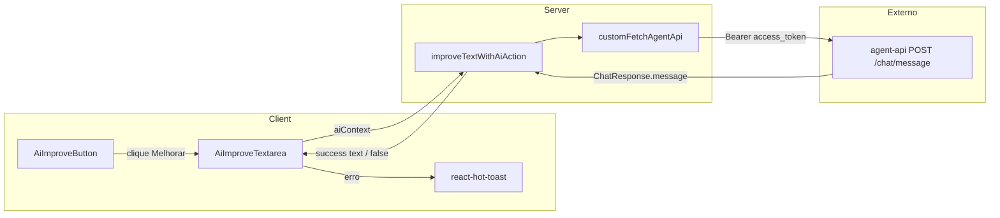
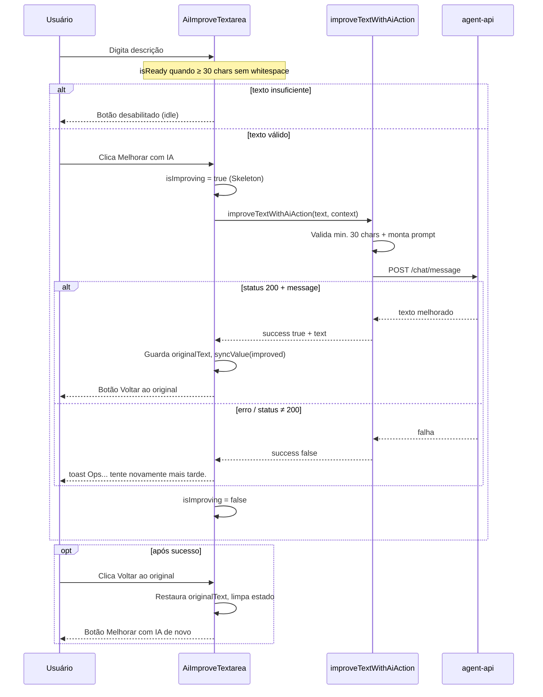
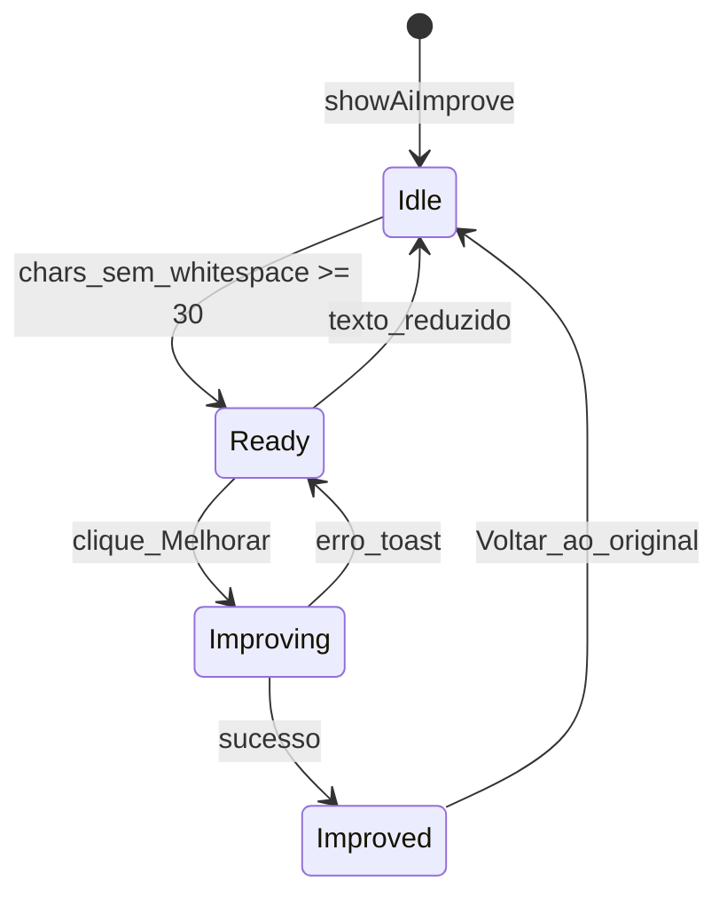

# Melhorar texto com IA

## Visão geral

A feature permite que o cidadão melhore descrições de texto (ex.: atividades profissionais no currículo) com ajuda de um agente de IA. O botão **Melhorar com IA** analisa o texto informado e sugere uma versão mais clara, profissional e objetiva — em geral em tópicos (bullet points), destacando responsabilidades e competências relevantes para recrutadores e sistemas ATS, sem inventar experiências.

Após a melhoria, o botão passa a **Voltar ao original**, permitindo reverter a alteração.

### Uso atual


| Campo                    | Página                               | `aiContext`              |
| ------------------------ | ------------------------------------ | ------------------------ |
| Descrição das atividades | Experiência profissional (currículo) | `experiencia-atividades` |
| Descrição                | Conquista/certificado (currículo)    | `conquista-descricao`    |


## Estrutura de arquivos

```
src/
├── actions/
│   └── improve-text-with-ai.ts          # Server Action + prompts por contexto
├── components/ui/custom/
│   ├── ai-improve-textarea.tsx          # Textarea + estados + integração com a action
│   └── ai-improve-button.tsx            # Botão "Melhorar com IA" / "Voltar ao original"
├── assets/icons/
│   └── ai-improve-icon.tsx
├── http-agent-api/                      # Cliente Orval (agent-api)
│   ├── chat/chat.ts                     # sendMessage → POST /chat/message
│   └── models/
│       ├── chatRequest.ts
│       └── chatResponse.ts
└── custom-fetch-agent-api.ts            # Mutator: base URL + JWT do cookie (server-only)
```


## Arquitetura

A chamada à agent-api **não** roda no browser. O mutator Orval (`custom-fetch-agent-api.ts`) usa `cookies()` de `next/headers` para injetar o Bearer token — isso só funciona em Server Components, Server Actions ou Route Handlers.

Por isso a feature usa o padrão já adotado no monorepo para mutations: **Server Action + Orval**.




## Fluxo completo




## Camadas


### 1. UI — `AiImproveTextarea`

Componente client (`'use client'`) que encapsula o textarea, o botão e o ciclo de vida da melhoria.

**Props principais:**


| Prop            | Default | Descrição                                                                                       |
| --------------- | ------- | ----------------------------------------------------------------------------------------------- |
| `showAiImprove` | `false` | Se `false`, renderiza um `Textarea` comum                                                       |
| `aiContext`     | —       | Contexto da Server Action (ex.: `experiencia-atividades`). Necessário se não houver `onImprove` |
| `minCharsForAi` | `30`    | Mínimo de caracteres **não vazios** (espaços e quebras ignorados)                               |
| `onImprove`     | —       | Override opcional; se presente, não chama a Server Action padrão                                |
| `error`         | —       | Mensagem de erro do formulário (ex.: Zod)                                                       |


**Exemplo de uso (currículo):**

```tsx
<AiImproveTextarea
  {...register(`empregos.${index}.descricaoAtividades`)}
  showAiImprove
  aiContext="experiencia-atividades"
  minCharsForAi={30}
  maxLength={2000}
  error={errors.empregos?.[index]?.descricaoAtividades?.message}
/>
```


### 2. Botão — `AiImproveButton`

Dois modos:


| `mode`    | Label              | Habilitação                         |
| --------- | ------------------ | ----------------------------------- |
| `improve` | Melhorar com IA    | `isReady === true` e não `disabled` |
| `revert`  | Voltar ao original | não `disabled`                      |


No modo `improve` sem `isReady`, o botão fica desabilitado com estilo “idle” (muted, sem fade agressivo).

### 3. Server Action — `improveTextWithAiAction`

Arquivo: `[src/actions/improve-text-with-ai.ts](../src/actions/improve-text-with-ai.ts)`

```ts
improveTextWithAiAction({
  text: string
  context: AiImproveContext  // 'experiencia-atividades' | 'conquista-descricao'
}): Promise<
  | { success: true; text: string }
  | { success: false }
>
```

Comportamento:

1. Faz `trim` do texto e valida ≥ 30 caracteres sem whitespace.
2. Seleciona o prompt em `AI_IMPROVE_PROMPTS[context]`.
3. Chama `sendMessage` com `session_id: crypto.randomUUID()` (chamada one-shot; sem histórico de conversa).
4. Em sucesso (`status === 200` e `message` não vazia), retorna `{ success: true, text }`.
5. Em qualquer falha (validação, status ≠ 200, exceção), retorna `{ success: false }` **sem** detalhes internos ao client.

> **Importante:** arquivos com `'use server'` só podem **exportar** funções `async`. O mapa de prompts (`AI_IMPROVE_PROMPTS`) fica **interno** ao módulo (não exportado).


### 4. API — agent-api (`http-agent-api`)

Cliente Orval gerado a partir do OpenAPI do [superapp-agent-api](https://github.com/prefeitura-rio/superapp-agent-api).


| Item     | Valor                                                    |
| -------- | -------------------------------------------------------- |
| Endpoint | `POST /chat/message`                                     |
| Função   | `sendMessage(chatRequest)`                               |
| Base URL | `AGENT_API_BASE_URL` (server-only)                       |
| Auth     | `Authorization: Bearer <access_token>` (cookie Keycloak) |


**Request (**`ChatRequest`**):**

```json
{
  "message": "<prompt montado + texto do usuário>",
  "session_id": "<uuid-v4>"
}
```

**Response (**`ChatResponse`**, status 200):**

```json
{
  "message": "<texto gerado pelo agente>",
  "session_id": "<uuid confirmado>"
}
```

Status de erro previstos no OpenAPI: `422` (body inválido), `502` (agente indisponível).

Não existe endpoint dedicado “melhorar texto”: a melhoria é feita montando um **prompt específico por** `aiContext` e enviando via chat genérico.

## Estados da UI




| Estado    | Condições                          | UI                                                                            |
| --------- | ---------------------------------- | ----------------------------------------------------------------------------- |
| Idle      | `!isReady`, sem melhoria           | Botão Melhorar desabilitado                                                   |
| Ready     | `isReady`, `originalText === null` | Botão Melhorar habilitado                                                     |
| Improving | `isImproving === true`             | Skeleton no lugar do texto; textarea oculto (mas montado); botão desabilitado |
| Improved  | `originalText !== null`            | Texto melhorado no campo; botão Voltar ao original                            |


### Detalhes de implementação

- `isReady`**:** `text.replace(/\s/g, '').length >= minCharsForAi` (espaços e quebras de linha não contam).
- `originalText`**:** guarda o texto **antes** da melhoria; `null` quando não há versão AI ativa.
- `syncValue`**:** escreve no DOM do textarea, atualiza estado interno e dispara `onChange` para o React Hook Form.
- **Skeleton:** o textarea **não é desmontado** durante o loading (`hidden` + Skeleton ao lado). Isso evita perder o `ref` e permite `syncValue` funcionar ao receber a resposta.
- **Erro:** `toast.error('Ops... tente novamente mais tarde.')` via `react-hot-toast`. O estado volta para Ready (usuário pode tentar de novo).
- **Uma melhoria por ciclo:** com `hasImproved`, só é possível melhorar de novo depois de reverter.


## Critério de habilitação vs validação do formulário

São regras **separadas**:


| Camada                                          | Regra                              | Feedback                                             |
| ----------------------------------------------- | ---------------------------------- | ---------------------------------------------------- |
| Botão IA (`AiImproveTextarea`)                  | ≥ 30 chars sem whitespace          | Botão desabilitado                                   |
| Formulário Zod (`curriculo-experiencia-schema`) | `descricaoAtividades.length >= 30` | Mensagem “Mínimo de 30 caracteres” no save/validação |


A mensagem de mínimo de caracteres do formulário continua no schema Zod; o botão de IA não exibe toast/tooltip extra quando o texto é curto.

## Prompt (`experiencia-atividades`)

O prompt instrui o agente a:

- Priorizar formatação em tópicos (bullet points)
- Destacar responsabilidades e competências para recrutadores/ATS
- Corrigir escrita e evitar genéricos/redundâncias
- Permanecer fiel ao texto do usuário (**não inventar** experiências)
- Retornar **apenas** o texto melhorado (sem prefácio)


## Extender para outros campos

1. Adicionar um novo valor em `AiImproveContext` e o prompt correspondente em `AI_IMPROVE_PROMPTS` em `[improve-text-with-ai.ts](../src/actions/improve-text-with-ai.ts)`.
2. No campo desejado, usar:

```tsx
<AiImproveTextarea
  showAiImprove
  aiContext="novo-contexto"
  {...register('campo')}
/>
```

Opcionalmente, passar `onImprove` para um fluxo customizado sem usar a Server Action padrão.

## Variáveis de ambiente


| Variável                         | Obrigatória | Descrição                                                                |
| -------------------------------- | ----------- | ------------------------------------------------------------------------ |
| `AGENT_API_BASE_URL` | Sim         | Base URL da agent-api (server-only; não usar `NEXT_PUBLIC_`). Ex.: staging/produção ou `http://localhost:8000` |


Sem essa variável, `customFetchAgentApi` lança erro ao montar a URL.

## Checklist de debug

- Botão nunca habilita → conferir contagem sem whitespace (≥ 30) e `showAiImprove` / `aiContext`
- Toast de erro imediato → `AGENT_API_BASE_URL`, cookie `access_token`, status da agent-api (502/422)
- Texto não atualiza no formulário → `syncValue` / `register` do RHF; garantir que o textarea permanece montado no loading
- Build “Server Actions must be async functions” → não exportar funções/objetos síncronos do arquivo `'use server'` (prompts devem ser internos)

