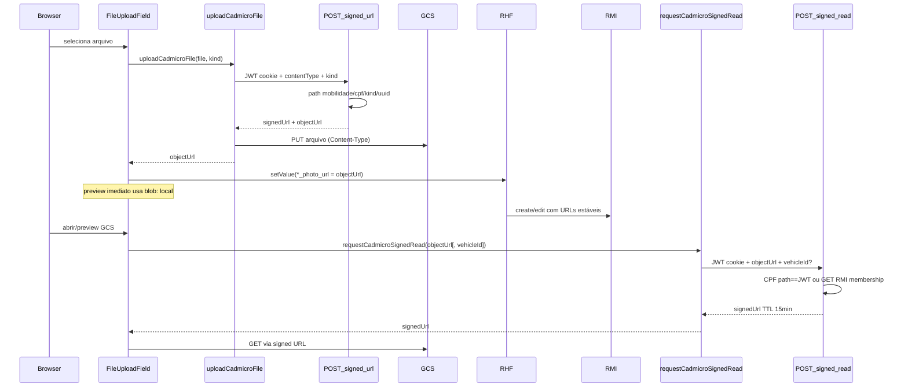

# CadMicro — Upload de arquivos via GCS (Signed URLs)

## Decisão de privacidade

Objetos CadMicro são **privados** (sem `x-goog-acl: public-read`).

Diferente do portal-interno (imagens públicas de curso), fotos de número de série, veículo e nota fiscal são documentos pessoais. A URL estável salva no RMI **não** é acessível com GET direto; preview/download passam pelo BFF que emite signed URL de leitura.

URL persistida no formulário / API:

```
https://storage.googleapis.com/<bucket>/mobilidade/<cpf>/<kind>/<uuid>.<ext>
```

`kind` ∈ `serial` | `vehicle` | `invoice`.

## Fluxo

1. Browser valida MIME (PNG/JPEG/PDF) e tamanho (≤ 7MB).
2. `POST /api/cadmicro/files/signed-url` com cookie JWT → `{ signedUrl, objectUrl }`.
3. Browser faz `PUT` direto no GCS (só header `Content-Type`).
4. RHF guarda `objectUrl` (nunca `blob:`).
5. Para abrir / preview remoto: `POST /api/cadmicro/files/signed-read` com `{ objectUrl, vehicleId? }` → `{ signedUrl }` → `window.open`, thumbnail ou PDF dialog. `vehicleId` é obrigatório quando o CPF do path ≠ CPF do JWT (condutor).



## Mapa UI → lib → API → GCS → RMI

Preview imediato após o pick usa `blob:` só na UI. O valor persistido no form e enviado ao RMI é sempre a `objectUrl` GCS (`https://storage.googleapis.com/...`). O schema Zod rejeita `blob:`.

| Path                                                                                                | Papel                                                                             |
| --------------------------------------------------------------------------------------------------- | --------------------------------------------------------------------------------- |
| `src/app/(app)/(logged-in)/carteira/cadmicro/adicionar-veiculo/components/file-upload-field.tsx`    | Pick file, upload, preview (`blob:` local / signed URL na edição), PDF dialog |
| `src/app/(app)/(logged-in)/carteira/cadmicro/adicionar-veiculo/components/serial-photos-fields.tsx` | Liga RHF aos três kinds (`serial` / `vehicle` / `invoice`)                 |
| `src/app/(app)/(logged-in)/carteira/cadmicro/adicionar-veiculo/schema.ts`                           | Rejeita`blob:`; exige URL `storage.googleapis.com`                            |
| `src/app/(app)/(logged-in)/carteira/cadmicro/[vehicleId]/components/verified-document-section.tsx`  | Abre documento pós-cadastro via signed-read                                      |
| `src/lib/cadmicro/file-types.ts`                                                                    | MIME, kinds, helpers client-safe                                                  |
| `src/lib/cadmicro/gcs.ts`                                                                           | Storage SDK, path, parse URL (server)                                             |
| `src/lib/cadmicro/upload-file.ts`                                                                   | Cliente de upload                                                                 |
| `src/lib/cadmicro/request-signed-read.ts`                                                           | Cliente de signed read                                                            |
| `src/app/api/cadmicro/files/signed-url/route.ts`                                                    | BFF write                                                                         |
| `src/app/api/cadmicro/files/signed-read/route.ts`                                                   | BFF read                                                                          |
| RMI                                                                                                 | Persiste URLs estáveis;**não** faz upload                                 |

## Variáveis de ambiente (server-only)

| Variável            | Descrição                                  |
| -------------------- | -------------------------------------------- |
| `GCS_BUCKET_NAME`  | Bucket (ex.:`rj-superapp-staging-prefrio`) |
| `GCS_CLIENT_EMAIL` | Service account                              |
| `GCS_PRIVATE_KEY`  | Chave RSA com`\n` escapado                 |

IAM necessário: `storage.objects.create`, `storage.objects.get`, `iam.serviceAccounts.signBlob`.

CORS do bucket deve permitir `PUT`/`GET`/`OPTIONS` + `Content-Type` nos origins do superapp (localhost e staging/prod).

Detalhes e checklist de aceite: [`cadmicro-gcs-infra-request.md`](./cadmicro-gcs-infra-request.md).

## Threat model / estado atual

| Controle                                          | Garantido hoje? | Onde                                                                 |
| ------------------------------------------------- | --------------- | -------------------------------------------------------------------- |
| Objeto privado no GCS (GET sem assinatura → 403) | Sim             | Upload sem`public-read`; infra                                     |
| SA nunca no browser                               | Sim             | Envs server-only + BFF assina                                        |
| Write só autenticado; path sob CPF do JWT        | Sim             | `signed-url/route.ts` + `buildCadmicroObjectPath`                  |
| Read exige JWT + URL no bucket/`mobilidade/`      | Sim             | `signed-read/route.ts` + `parseCadmicroObjectUrl`                  |
| Read só se CPF do path = CPF do JWT              | Sim             | `canSignedReadObjectUrl` (match direto)                            |
| Membership dono/condutor                          | Sim             | Fallback: `vehicleId` + GET RMI detalhe; URL deve pertencer ao veículo |
| Anti-enumeração                                 | Parcial         | UUID no path;**não** é autorização sozinha                       |

**Autorização de leitura:** o BFF assina read se (1) o CPF do path for o do JWT, ou (2) o cliente enviar `vehicleId` e o GET `/citizen/{cpf}/vehicles/{vehicleId}` (dono ou condutor aceito) devolver a `objectUrl` entre as fotos do veículo. URL “vazada” sem membership → 403.

## TODOs restantes

1. Contrato `invoice_photo_url` no RMI (seção abaixo) — Orval já tipa o campo; validar handoff/Swagger.

## Gap de contrato RMI — Nota Fiscal

O handoff atual expõe `has_invoice: boolean` mas **não** um campo de URL da NF.

**Proposta:** adicionar `invoice_photo_url: string | null` no Vehicle:

- Obrigatório na API quando `has_invoice=true`
- Presente em `POST` / `PATCH` / `GET` de veículos
- Condutor: leitura; sem edição

O superapp já envia `invoice_photo_url` no payload de create/edit. Regenerar Orval quando o Swagger do RMI incluir o campo.
